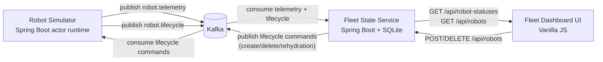

# RoboFleet Control Plane

I built this as a portfolio-grade, event-driven robotics control-plane MVP to demonstrate how I:

- model robots as runtime actors,
- stream state through Kafka,
- materialize queryable fleet state in a backend service,
- and expose operator-facing visibility through a lightweight dashboard.

If you are evaluating this project quickly, start here:

- **5-minute demo**: [Quick start](#quick-start-5-minutes)
- **engineering depth**: [Technical highlights](#technical-highlights)
- **long-form project guide**: [`docs/mvp-handbook.md`](docs/mvp-handbook.md)

---

## What this project demonstrates about me

I intentionally structured this repository to showcase practical software engineering and robotics-adjacent systems thinking:

- **Event-driven architecture** (Kafka topics, async lifecycle choreography)
- **Materialized view design** (latest-state projection for low-latency reads)
- **Domain separation** (simulator runtime vs control-plane API vs operator UI)
- **Resilience patterns** (startup rehydration of active robots)
- **Contract-first integration** (Pact tests in consumer and provider roles)
- **Operational ergonomics** (one-command bootstrap scripts with Docker/no-Docker fallback)
- **Robotics roadmap maturity** (explicit evolution path to ROS2 + Gazebo)

---

## Technical highlights

1. **Actor-style simulation model**  
   I model robots as mutable in-memory actors with explicit locking and deterministic state advancement hooks.

2. **Lifecycle command/event choreography**  
   I model create/delete/rehydrate behavior as lifecycle events with handler-based dispatch on both service and simulator sides.

3. **Startup rehydration for resilience**  
   I implement startup rehydration to republish active robot state after service restart, allowing runtime actor restoration without duplicate registration.

4. **Read-optimized projection service**  
   I implement fleet state materialization by consuming telemetry and continuously upserting latest robot state, giving operators a low-latency “current truth” API.

5. **Operator-oriented API semantics**  
   I keep read APIs paging/sorting friendly, and I return `202 Accepted` for async create/delete lifecycle processing.

6. **Operationally realistic UI behavior**  
   I design the dashboard around real operator workflows: live refresh controls, backend sorting, details panel, and async lifecycle feedback.

7. **Contract-testing discipline across modules**  
   I wire both modules into Pact generation and verification in both directions, with root Maven orchestration for full cross-module contract flow.

8. **Unified multi-stack verification**  
   I orchestrate Java tests, contract checks, and dashboard UI tests in one root-level verification pipeline.

9. **Reproducible local operations**  
   I provide one-command scripts that handle startup/shutdown, logs, and Docker/no-Docker Kafka paths for consistent demos.

10. **Versioned contracts and phased roadmap**  
   I document event metadata/versioning policies and an explicit evolution path from MVP control-plane behavior toward ROS2 and Gazebo simulation flows.

---

## System architecture (at a glance)

### Visual diagram (Mermaid)

```text
Robot Simulator (Spring Boot actor runtime)
    -> Kafka topic: robot.telemetry
    -> Kafka topic: robot.lifecycle

Fleet State Service (Spring Boot)
    <- consumes telemetry + lifecycle
    -> materializes latest robot state in SQLite
    -> exposes REST APIs (/api/robot-statuses, /api/robots)
    -> publishes lifecycle commands for create/delete/rehydration

Fleet Dashboard UI (Vanilla JS)
    -> polls Fleet State Service for fleet snapshot + details
    -> supports create/delete flows + backend-driven sorting
```



Repository layout:

```text
.
├── robot-simulator/        # edge/runtime actor simulation
├── fleet-state-service/    # control-plane state materialization + APIs
├── fleet-dashboard-ui/     # operator visibility UI
├── docs/contracts/         # versioned message contracts
├── docs/roadmap/           # phased evolution plan
└── scripts/                # reproducible local run/stop tooling
```

---

## Quick start (5 minutes)

### Prerequisites

- Java 21+
- Maven 3.9+
- Docker / Docker Compose (recommended)
- Python 3.10+ (used by local UI hosting flow in scripts)

### One-command launch

```bash
chmod +x scripts/mvp-up.sh scripts/mvp-down.sh
./scripts/mvp-up.sh
```

This starts Kafka, fleet-state-service, robot-simulator, and dashboard UI.

Stop everything:

```bash
./scripts/mvp-down.sh
```

### Verify

- Dashboard: `http://localhost:5173/?apiBase=http://localhost:8080`
- Fleet snapshot API: `http://localhost:8080/api/robot-statuses`
- Single robot state API: `http://localhost:8080/api/robot-statuses/{id}`
- Robot lifecycle summary API: `http://localhost:8080/api/robots`

If startup scripts pick a fallback port (for example `8081`), use the printed URL from script output.

---

## Engineering quality signals

- Unit tests across application/domain/infrastructure layers
- Integration tests in `fleet-state-service/src/integ`
- Pact-based API and event contract tests in both producer/consumer directions
- Modularized README documentation per component
- Versioned contracts and explicit compatibility policy under `docs/contracts`

Run full verification:

```bash
mvn -f pom.xml verify
```

This includes Java module verification, Pact orchestration, and dashboard UI tests (`fleet-dashboard-ui` `npm test`).

Skip root contract orchestration (module lifecycle only):

```bash
mvn -f pom.xml -DskipContractTests=true verify
```

Skip UI tests when needed:

```bash
mvn -f pom.xml -DskipUiTests=true verify
```

---

## Robotics concepts represented today vs next

### Implemented now

- Robot runtime simulation with map boundaries and advancement behavior
- Telemetry and lifecycle event streaming
- Control-plane state materialization and operator visibility

### Planned next (documented roadmap)

- Task command/status domain
- ROS2 bridge layer for execution runtime integration
- Gazebo simulation-driven task execution validation
- Reliability hardening for multi-robot orchestration

Roadmap details: [`docs/roadmap/README.md`](docs/roadmap/README.md)

---

## Documentation map

- Detailed project handbook (rephrased long-form root guide): [`docs/mvp-handbook.md`](docs/mvp-handbook.md)
- Event contracts and metadata policy: [`docs/contracts/README.md`](docs/contracts/README.md)
- Phase-by-phase execution roadmap: [`docs/roadmap/README.md`](docs/roadmap/README.md)
- Module docs:
  - [`robot-simulator/README.md`](robot-simulator/README.md)
  - [`fleet-state-service/README.md`](fleet-state-service/README.md)
  - [`fleet-dashboard-ui/README.md`](fleet-dashboard-ui/README.md)
  - [`scripts/README.md`](scripts/README.md)
